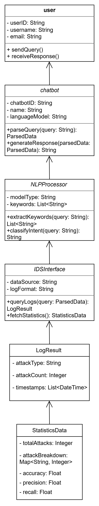

# BotsOnPatrol_IDS.
AI-Powered Intrusion Detection System with ML, DL, and Chatbot Interface.
# 🤖 Bots on Patrol: AI-Powered Intrusion Detection System

## 🎯 Overview
Bots on Patrol is an AI-powered Intrusion Detection System (IDS) designed to detect and classify network attacks in real-time.  
The system combines Machine Learning (ML), Deep Learning (DL), and a conversational Chatbot interface to make network security insights accessible to both technical and non-technical users.

---

## 🧩 Project Objectives
- Detect and classify network-level attacks (DDoS, Brute Force, Port Scan, etc.)
- Improve **precision** (reduce false alarms) while maintaining high accuracy
- Deploy trained models on lightweight hardware (Raspberry Pi)
- Build a **Chatbot Interface** for easy, natural-language queries about IDS performance and detected anomalies

---

## 📊 Dataset
- **Dataset:** NF-IoT Dataset (latest version provided by Dr. Atik)
- **Scope:** IoT network traffic — real-world attack simulations
- **Preprocessing:** feature extraction, normalization, encoding

---

## ⚙️ Models & Algorithms
Supervised ML models:
- Decision Tree 🌳  
- Random Forest 🌲  
- Naïve Bayes 📊  
- SVM ⚙️  
- Logistic Regression 🧮  
- KNN 🔍  

Next: Deep Learning models (CNN, LSTM) for multi-class detection.

---

## 🧮 Evaluation Metrics
| Metric | Description | Why it Matters |
|---------|--------------|----------------|
| Accuracy | Correct predictions overall | Shows general performance |
| Precision | % of predicted attacks that are real | Reduces false positives |
| Recall | % of real attacks correctly detected | Avoids missing real attacks |
| F1 Score | Balance between precision and recall | Fair model comparison |

🎯 **Goal:** Accuracy & Precision ≥ 90%

---

## 💬 Chatbot Interface
- Converts IDS logs into natural-language summaries  
- Users can ask:
  - “How many anomalies were detected today?”
  - “Which attack type is most common this week?”
  - “What’s the model precision?”
- Built using **Python (Flask / Streamlit + Pandas)**
- Future plan: integrate a small **LLM** for more natural dialogue

---

## 🧠 Learning & Courses
To enhance AI and ML capabilities:
- **NVIDIA Deep Learning & Generative AI Courses**
- **SDAIA AI Fundamentals**
- **IBM & Coursera ML Certificates**

These build the foundation for IDS model training and Chatbot fine-tuning.

---

## 🧱 Repository Structure

---

## 🪜 Next Steps
- Apply ML models on NF-IoT dataset  
- Train and evaluate DL models (CNN, LSTM)  
- Deploy lightweight model on Raspberry Pi  
- Integrate Chatbot into the dashboard  
- Continue research and course completions  

---

## 👩‍💻 Team
**Advisor:** Dr. Jawad  
**Team Members:**  
- Walaa — AI/ML & Chatbot Development  
- Raghad — Literature Review & ML Evaluation  
- Reema & Majd — Model Implementation & Raspberry Pi Deployment

---
## 🧩 UML Diagram for Chatbot Interface

This diagram represents the chatbot interface flow and how it interacts with the IDS modules.

